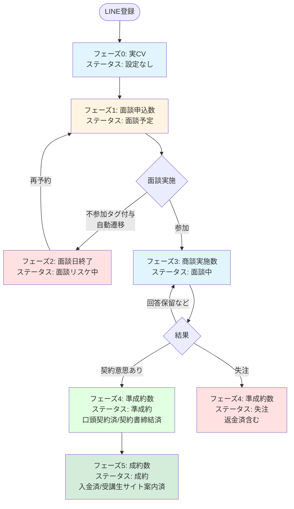
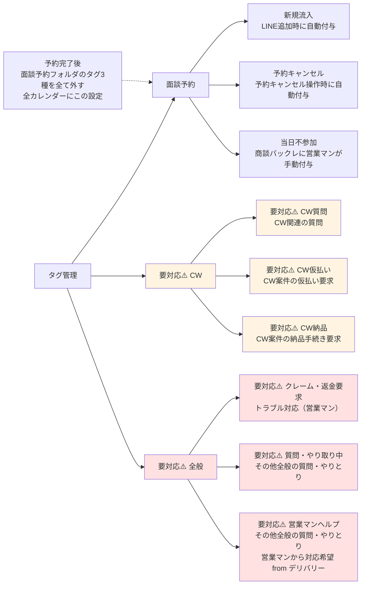
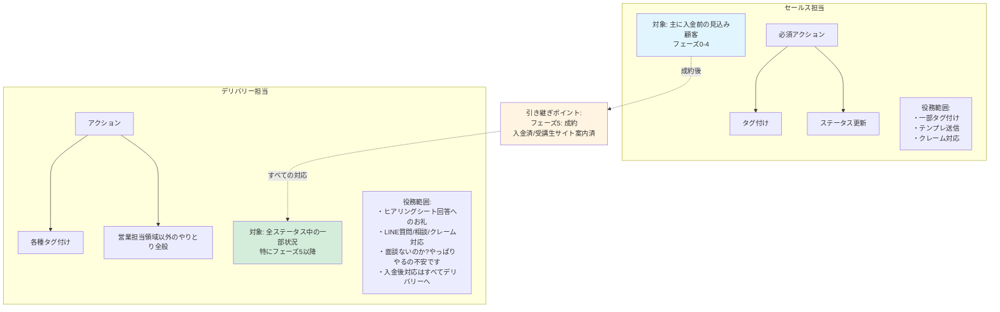
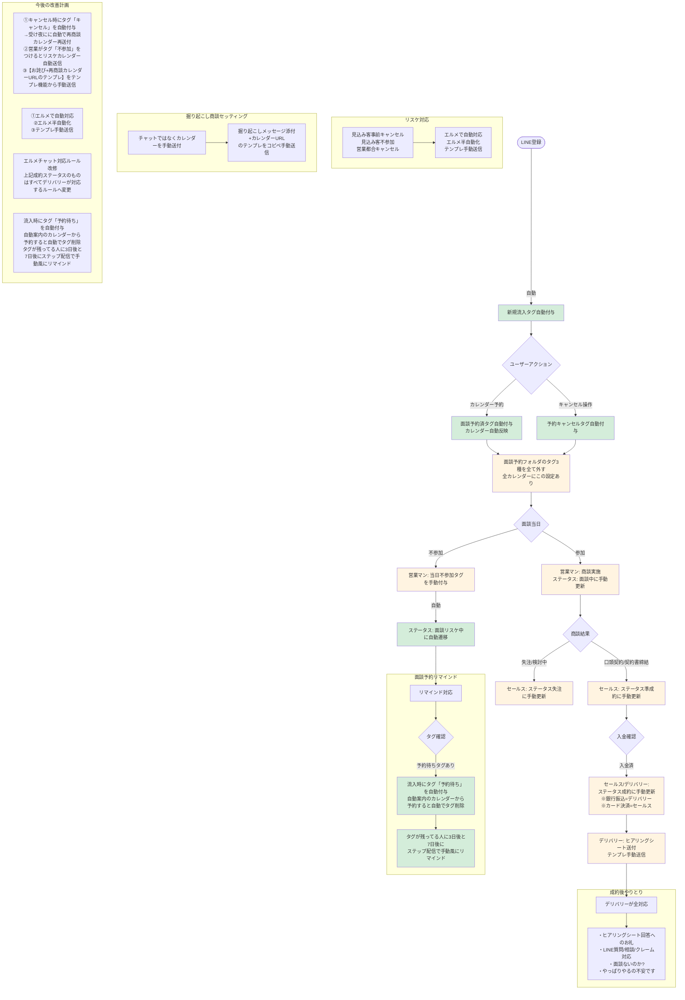

# エルメチャット対応フロー設計書

## 概要
本資料は、LINE公式アカウント（エルメッセージ）を活用した顧客対応フローの全体設計をまとめたものです。

---

## 1. 顧客ステータス遷移フロー

### ステータス詳細

| フェーズ | 広告レポート集計判定 | ステータス設定 | 意味 |
|---------|-------------------|--------------|------|
| 0 | 実CV（LINE登録） | ステータス設定なし | LINE登録はしたものの、面談申し込みに至っていない |
| 1 | 面談申込数 | [S] 面談予定 | 面談申し込み済み（カレンダー自動反映済み） |
| 2 | 面談日終了 | [S] 面談リスケ中 | 不参加タグを営業マンがつけると自動でこのステータスへ |
| 3 | 商談実施数（着座） | [S] 面談中（回答保留など） | 面談の結果が未確定（商談内で再面談予約済み） |
| 4 | 準成約数 | [S] 準成約（口頭契約済/契約書締結済） | セールスが口頭のみで成約 or 契約書締結完了 |
| 4 | 準成約数 | [S] 失注（返金済含む） | 失注 or 商談中に再面談日を設定できなかった「検討中」 |
| 5 | 成約数 | [SD] 成約（入金済/受講生サイト案内済） | 決済を確認し、ヒアリングシートを送った状態。※銀行振込はデリバリー、カード決済はセールス対応 以降、デリバリーがあらゆるやりとりを対応 |

---

## 2. タグ管理体系図

### タグ自動付与ルール

| タグフォルダ | タグ | 意味 | 備考 |
|-----------|------|------|------|
| 面談予約 | 新規流入 | LINE追加時に自動付与 | 予約完了後、面談予約フォルダのタグ3種を全て外す（全カレンダーにこの設定） |
| 面談予約 | 予約キャンセル | 予約キャンセル操作時に自動付与 | 予約完了後、面談予約フォルダのタグ3種を全て外す（全カレンダーにこの設定） |
| 面談予約 | 当日不参加 | 商談バックレに営業マンが手動付与 | 予約完了後、面談予約フォルダのタグ3種を全て外す（全カレンダーにこの設定） |
| 要対応⚠️ CW | 要対応⚠️ CW質問 | CW関連の質問 | マイさんタグ付け→宮ちゃん対応 |
| 要対応⚠️ CW | 要対応⚠️ CW仮払い | CW案件の仮払い要求 | マイさんタグ付け→宮ちゃん対応 |
| 要対応⚠️ CW | 要対応⚠️ CW納品 | CW案件の納品手続き要求 | マイさんタグ付け→宮ちゃん対応 |
| 要対応⚠️ 全般 | 要対応⚠️ クレーム・返金要求 | トラブル対応（営業マン） | 返金の相談を金田さんとしつつ対応 |
| 要対応⚠️ 全般 | 要対応⚠️ 質問・やり取り中 | その他全般の質問・やりとり | CW以外のあらゆる質問・やりとり |
| 要対応⚠️ 全般 | 要対応⚠️ 営業マンヘルプ | その他全般の質問・やりとり （営業マンから対応希望 from デリバリー） | デリバリーメンバーは返答が難しい内容 |

---

## 3. 役割分担とアクション

### 詳細役割分担表

| 担当 | 役務範囲 | アクション | その他 |
|------|---------|-----------|--------|
| セールス | 主に入金前の見込み顧客 （フェーズ0-4） | ・一部タグ付け ・テンプレ送信 ・クレーム対応 | **タグ付けとステータス更新だけマスト** |
| デリバリー | 全ステータス中の一部状況 特にフェーズ5以降 | ・各種タグ付け ・営業担当領域以外のやりとり全般 | 入金後対応はすべてデリバリーへ |

---

## 4. システム全体フロー（自動化・手動の区別）

### 自動化と手動の区分

| 処理 | 自動/手動 | 説明 |
|------|----------|------|
| LINE登録時のタグ付与 | 🤖 自動 | エルメの自動化機能 |
| カレンダー予約時のタグ付与 | 🤖 自動 | エルメの自動化機能 |
| カレンダー反映 | 🤖 自動 | エルメの自動化機能 |
| キャンセル時のタグ付与 | 🤖 自動 | エルメの自動化機能 |
| 不参加タグ付与 | 👤 手動 | 営業マンが商談リンクで検知して手動付与 |
| リスケ中ステータス遷移 | 🤖 自動 | 不参加タグが付与されると自動遷移 |
| ステータス更新（準成約/失注/成約） | 👤 手動 | セールス/デリバリーが手動更新 |
| テンプレ送信 | 👤 手動 | 全て手動送信 |
| リマインド配信 | 🤖 自動 | ステップ配信で自動化 |
| タグ削除（予約完了後） | 🤖 自動 | カレンダー設定で自動化 |

---

## 5. 今後の改善計画

### リスケ対応
| チャット内容 | 例・詳細 | 今後 |
|------------|---------|------|
| リスケ | ①見込み客事前キャンセル ②見込み客不参加 ③営業都合キャンセル | ①エルメで自動対応 ②エルメ半自動化 ③テンプレ手動送信 |

**詳細:**
- ①キャンセル時にタグ「キャンセル」を自動付与→受け夜にに自動で再商談カレンダー再送付
- ②営業がタグ「不参加」をつけるとリスケカレンダー自動送信
- ③【お詫び+再商談カレンダーURLのテンプレ】をテンプレ機能から手動送信

### 掘り起こし商談セッティング
- チャットではなくカレンダーを手動送付
- 【掘り起こしメッセージ添付+カレンダーURL】のテンプレをコピペ手動送信

### 成約後やりとり
| チャット内容 | 例・詳細 | 今後 |
|------------|---------|------|
| 成約後やりとり | ・ヒアリングシート回答へのお礼 ・LINE質問/相談/クレーム対応 ・面談ないのか? ・やっぱりやるの不安です | 入金後対応はすべてデリバリーへ |

**詳細:**
- エルメチャット対応ルール改修
- 上記成約ステータスのものはすべてデリバリーが対応するルールへ変更

### 面談予約リマインド
- LINE流入後面談予約しない人に対して。※月10年くらい予約入るとうれしい
- **今後:** ステップ配信で自動化

**詳細:**
- 流入時にタグ「予約待ち」を自動付与
- 自動案内のカレンダーから予約すると自動でタグ削除
- タグが残ってる人に3日後と7日後にステップ配信で手動風にリマインド

---

## 付録: システム構成

### 使用プラットフォーム
- **LINE公式アカウント**: 顧客とのコミュニケーション
- **エルメッセージ**: LINE自動化・タグ管理・ステータス管理

### 連携システム
- **カレンダー**: 面談予約の自動反映
- **ステップ配信**: リマインド自動送信

### データ管理
- **タグフォルダ構造**: 面談予約 / 要対応⚠️CW / 要対応⚠️全般
- **ステータス管理**: [S]セールス担当 / [SD]セールス→デリバリー引継

---

## まとめ

本設計では、以下を実現しています：

1. **顧客ステータスの明確化** - フェーズ0〜5までの明確な遷移ルール
2. **自動化の最大化** - タグ付与、カレンダー反映、リマインド配信を自動化
3. **役割分担の明確化** - セールスとデリバリーの責任範囲を明示
4. **段階的改善** - 現状の手動対応を段階的に自動化する計画

この設計により、顧客対応の品質向上と業務効率化の両立を目指します。
